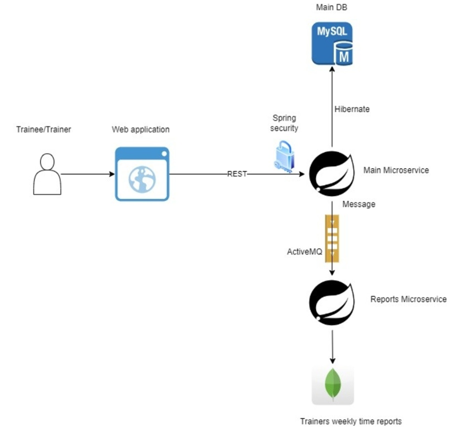
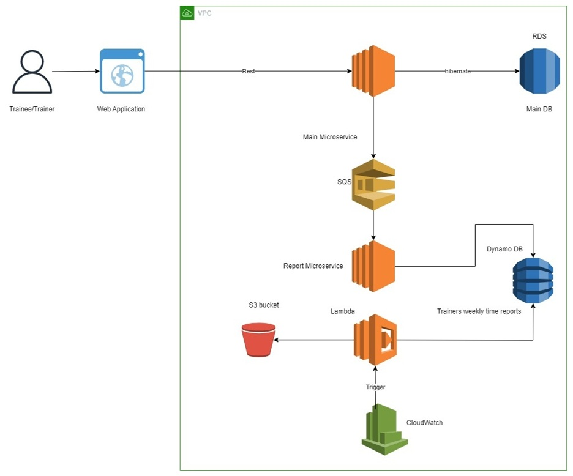
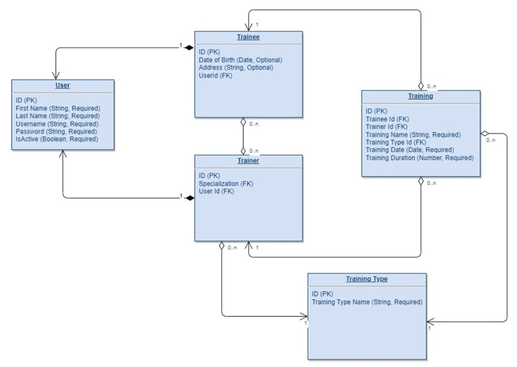

# Gym Application

## General Description

The Gym Application is made to help gym trainees and trainers work together better. It lets users:

- **User Registration**: Create profiles for trainees and trainers. Trainees can choose one or more trainers.
- **Activity Logging**: Add and check activities as a trainee or a trainer.
- **Profile Management**: Change profile details and turn profiles on or off.
- **Login System**: Log in to use the app (except for registration).
- **Weekly Summary**: Trainers can see how much they trained each week.

## Component Diagram

### I) On-Premise Version

### II) Cloud Version

## Database Schema

### I) RDBMS

#### 1. User Table
- `ID` (PK)
- `First Name` (String, Required)
- `Last Name` (String, Required)
- `Username` (String, Required)
- `Password` (String, Required)
- `Is Active` (Boolean, Required)

#### 2. Trainee Table
- `ID` (PK)
- `User ID` (FK, Required)
- `Date of Birth` (Date, Optional)
- `Address` (String, Optional)

#### 3. Trainer Table
- `ID` (PK)
- `User ID` (FK, Required)
- `Specialization ID` (Training Type ID, FK, Required)

#### 4. Trainee2Trainer Table
- `ID` (PK)
- `Trainee ID` (FK, Required)
- `Trainer ID` (FK, Required)

#### 5. Training Table
- `ID` (PK)
- `Trainee ID` (FK, Required)
- `Trainer ID` (FK, Required)
- `Training Name` (String, Required)
- `Training Type ID` (FK, Required)
- `Training Date` (Date, Required)
- `Training Duration` (Number, Required)

#### 6. Training Type Table
- `ID` (PK)
- `Training Type Name` (String, Required, like Fitness, Yoga, Zumba, Stretching, Resistance)

### II) Table Diagram

### III) MongoDB
#### Trainings Summary Duration
- `Trainer Username`
- `Trainer First Name`
- `Trainer Last Name`
- `Trainee Status` (Active, Inactive)
- `Years List`
- `Months List`
    - Trainings summary duration

## Lambda Logic Description

### Scope

This app uses AWS Lambda to make weekly trainer training reports using a CloudWatch trigger. Here's what it does:

1. Connects to DynamoDB to get data from the `Trainings Duration Summary` table.
2. Creates a CSV report with:
    - Trainer First Name
    - Trainer Last Name
    - Current month's training summary time
3. Uploads the CSV to an S3 bucket.

### Notes
- The report includes both active and inactive trainers.
- The report name follows this format: `Trainers_Trainings_summary_YYYY_MM`.
- Inactive trainers with zero training time are not included.

#### DynamoDB Table Structure
- `Trainer Username`
- `Trainer First Name`
- `Trainer Last Name`
- `Trainee Status` (Active, Inactive)
- `Years List`
    - `Months List`
        - Trainings duration summary

## REST API Endpoints

### 1. Trainee Registration
**Request**:
- First Name (required)
- Last Name (required)
- Date of Birth (optional)
- Address (optional)

**Response**:
- Username
- Password

### 2. Trainer Registration
**Request**:
- First Name (required)
- Last Name (required)
- Specialization (required)

**Response**:
- Username
- Password

### 3. Login
**Request**:
- Username (required)
- Password (required)

**Response**:
- `200 OK`

### 4. Change Login
**Request**:
- Username (required)
- Old Password (required)
- New Password (required)

**Response**:
- `200 OK`

### 5. Get Trainee Profile
**Request**:
- Username (required)

**Response**:
- First Name
- Last Name
- Date of Birth
- Address
- Is Active
- Trainers List

### 6. Update Trainee Profile
**Request**:
- Username (required)
- First Name (required)
- Last Name (required)
- Date of Birth (required)
- Address (required)
- Is Active (required)

**Response**:
- Updated profile details

### 7. Delete Trainee Profile
**Request**:
- Username (required)

**Response**:
- `200 OK`

### 8. Get Trainer Profile
**Request**:
- Username (required)

**Response**:
- First Name
- Last Name
- Specialization
- Is Active
- Trainees List
    - Trainee Username
    - Trainee First Name
    - Trainee Last Name

### 9. Update Trainer Profile
**Request**:
- Username (required)
- First Name (required)
- Last Name (required)
- Specialization (read-only)
- Is Active (required)

**Response**:
- Username
- First Name
- Last Name
- Specialization
- Is Active
- Trainees List
    - Trainee Username
    - Trainee First Name
    - Trainee Last Name

### 10. Get Unassigned Trainers
**Request**:
- Username (required)

**Response**:
- Trainer Username
- Trainer First Name
- Trainer Last Name
- Trainer Specialization

### 11. Update Trainee's Trainer List
**Request**:
- Trainee Username (required)
- Trainers List (required)
    - Trainer Username (required)

**Response**:
- Trainers List
    - Trainer Username
    - Trainer First Name
    - Trainer Last Name
    - Trainer Specialization

### 12. Get Trainee Trainings List
**Request**:
- Username (required)
- Period From (optional)
- Period To (optional)
- Trainer Name (optional)
- Training Type (optional)

**Response**:
- Training Name
- Training Date
- Training Type
- Training Duration
- Trainer Name

### 13. Get Trainer Trainings List
**Request**:
- Username (required)
- Period From (optional)
- Period To (optional)
- Trainee Name (optional)

**Response**:
- Training Name
- Training Date
- Training Type
- Training Duration
- Trainee Name

### 14. Add Training
**Request**:
- Trainee Username (required)
- Trainer Username (required)
- Training Name (required)
- Training Date (required)
- Training Type (required)
- Training Duration (required)

**Response**:
- `200 OK`
